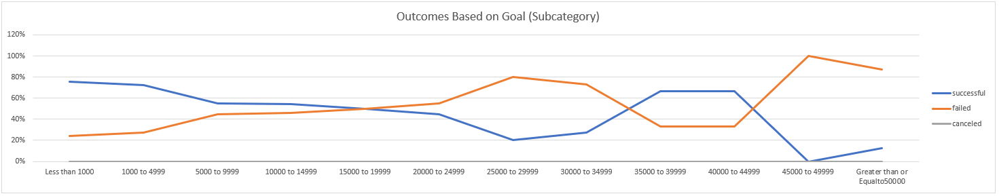
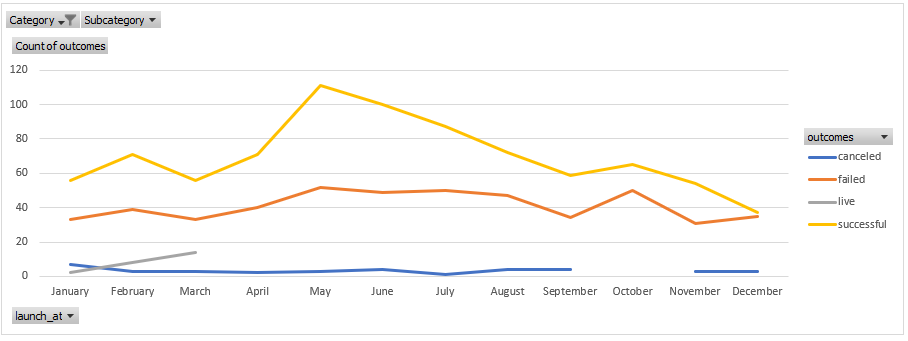

# Kickstarter-Analysis
Analyses of Kickstarter outcomes in order to gain insight for increasing the odds of receiving funding
### Challenge
Louise wants to maximize the likelihood of success for his theater production fundraiser,
the analysis focused on examining outcome based on:
-	Dollar amount of goals under subcategory “Play” 
-	Launch dates under the category “Theater”

When looking over outcomes based on goal, one could conclude that goals between $0-5,000 were largely successful with a rate of above 70%. A steep decline was then seen between $5,000-25,000 where the odds of success declined to the mid-50’s. It picks back up again between $35,000-45,000. With the exception of a couple of outliers, nothing greater than $45,000 was successful. There seems to be a U-shape curve in success, Louise should keep in mind that success drops off notably between $25,000-35,000
- Potential limitations: The U-shaped outcomes could have been due to large local support and awareness; we cannot know how significant that support was towards the success rate. If the production is relatively small in scope, he should probably keep his goal less than $10,000 unless larger local support can be mustered. Additionally, frequency dramatically decreases after the $5,000 mark, which may skew results of success based on percentage. This lends to the assumption that those larger productions were primarily supported by locals, if Louse is strictly seeking anonymous internet support, he will want to limit himself to $5,000 if he wants to be successful.
---
Outcome based on launch is much more straight forward and does not have the same limitation of frequency. Summer productions by far had more successful outcomes. Louise should also avoid the holiday months for launch and if possible, have his production in the summer. The peak of successful launches is in May and linearly decline as the fall is approached. 
- Potential limitations: The issue of frequency is less pronounced but still can be seen. May has more than double the launches of December and so the success rate of May becomes a more robust figure. We also do not know the relative theatrical openings to launch date, which begs the question of whether or not Louise could fundraise in the summer and have a winter play. This is notable because of the stark contrast of successes of summer launches. The launches are relevant to all theater subcategories, but the results for plays specifically did not change the results materially.
---
In summation:
1)	Louise should keep his goal less than 5,000 unless he has large local support
2)	Louise should launch his fundraiser at the beginning of the summer
3)	If Louise needs more funding, he will need to market his production locally to increase his odds of success
---
**In should also be noted that numerical analysis does not take into account the qualitative features of these productions and will not give insight to details pertaining to genre, descriptions, additional marketing, etc. **

---
Excel Specific documentation
---
*Category and Subcategory have been separated into two columns for specificity*
1) "Data" -> "Data Tools" -> "Text to Column"; Separate: Categories/Subcategories via "/" delimiter
2) iferror() was used to default to 0%
3) I isolated the unique categories and subcategories with the "advanced filters" to create two lists that are in a hidden sheet
3)  "Data" -> "Data Tools" -> "Data Validation"; I then used those hidden lists to create drop down menus to specify Category and Subcategory 
4) The tables reference the original data set and the desired specifications
5) I ran into problems parsing when only category was specified, so I just made separate tables for them
6) The labels for the “Outcomes Based on Goals” chart are concatenated and made invisible in cells A4:A15
